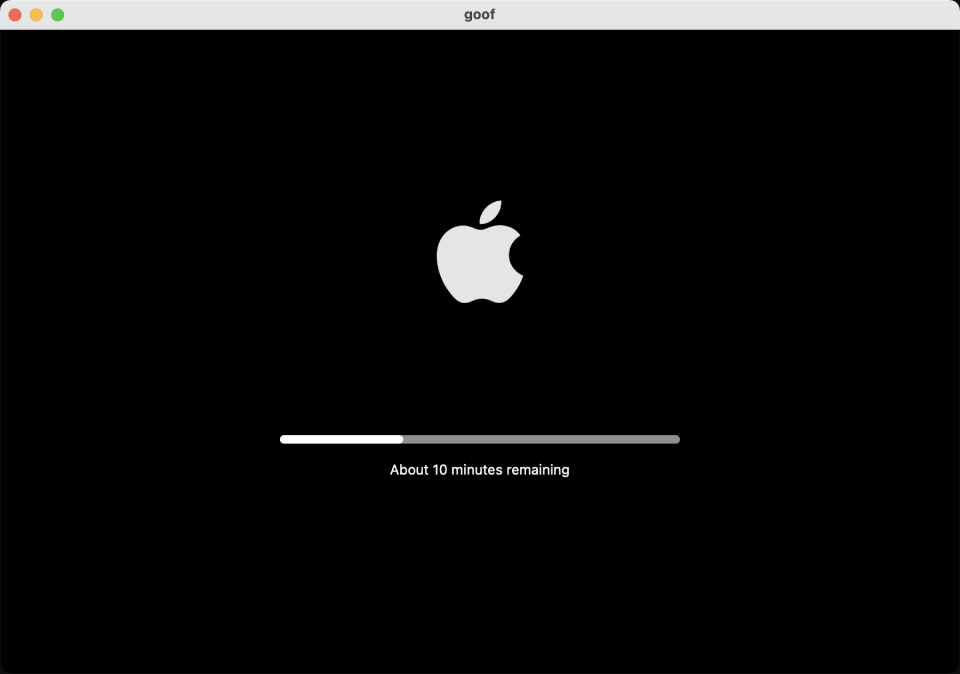

# Goaf-Happy-Fishing

A macOS app to simulate the system update.

Turn on the app, then take a cup of coffee for rest.

## Install

You can download the app from our [latest release](https://github.com/logeast/Goaf-Happy-Fishing/releases/latest)，`Assets/Goof.zip` is the finnal app. Then unzip and move Goof to your Applications.

### Tips

> While you install the app, maybe you will meet this is unkown developer or similar questions. You can just run the below command in your Terminal.

```bash
# You should input you password of the macOS system when you enter the command.
sudo spctl --master-disable
```

## Our Logo

Our logo is a goldfish swimming in the water. Which is inspared with the Figma Draft named [interactive fish tank illustrations](https://www.figma.com/community/file/1047377800290712934/interactive-fish-tank-illustrations), Thanks Erin so march.


And if you are insterested in design, this is [our design file](https://www.figma.com/file/i4QqODXPhRXzshhqt8PhEd/Goof---Happy-Fishing?node-id=0%3A1) on Figma.

## Feature

Until now, the only function of the app is just simulate a macOS system update.


