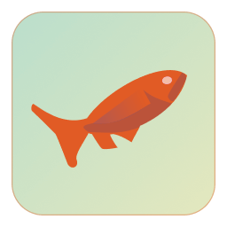
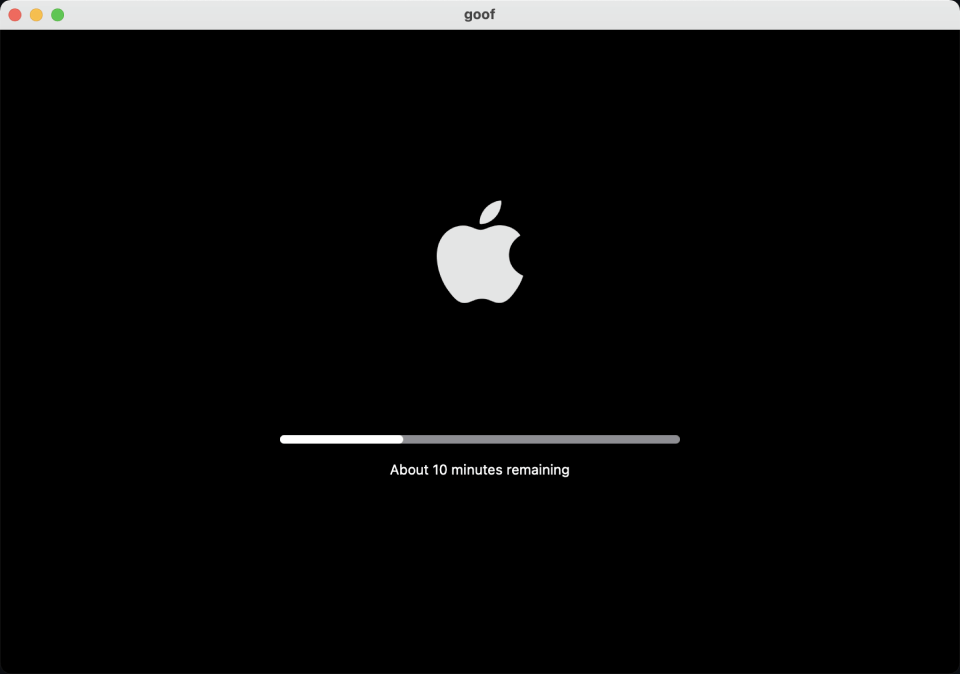

# Goaf - 快乐摸鱼

[English](./README.md) | [中文](./README.zh.md)

一款模拟 macOS 系统更新的 APP。

打开它，然后喝一杯咖啡休息一下吧。

## 安装

你可以通过[最新发布](https://github.com/logeast/Goaf-Happy-Fishing/releases/latest) 的 `Assets/Goof.zip` 来获取最新版本，然后解压缩并移动到你的应用程序中。

### 技巧

> 当你安装应用过程中，遇到文件已损坏或者未知开发者或类似的问题，你可以在终端种执行下面这行代码。

```bash
# 当你回车的时候你需要输入密码。
sudo spctl --master-disable
```

## 我们的 Logo

我们的 logo 是一只在水中游弋的金鱼，灵感来自 [interactive fish tank illustrations](https://www.figma.com/community/file/1047377800290712934/interactive-fish-tank-illustrations)，非常感谢 Erin。



如果你对设计有兴趣，这里是我们在 Figma 上的[设计文件](https://www.figma.com/file/i4QqODXPhRXzshhqt8PhEd/Goof---Happy-Fishing?node-id=0%3A1)。

## 特性

目前为止，APP 的唯一功能就是模拟 macOS 系统的更新。


